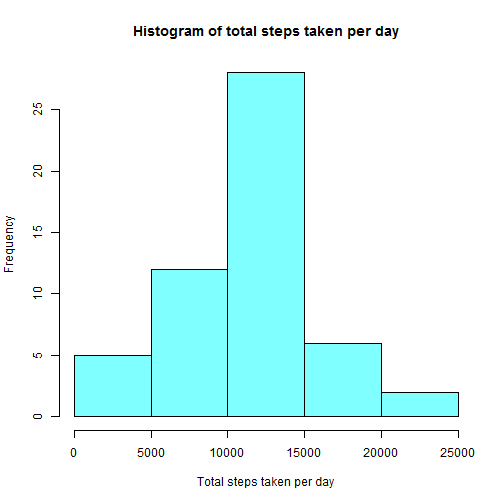
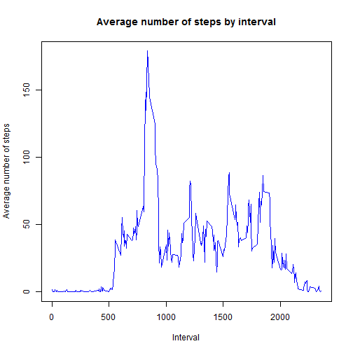
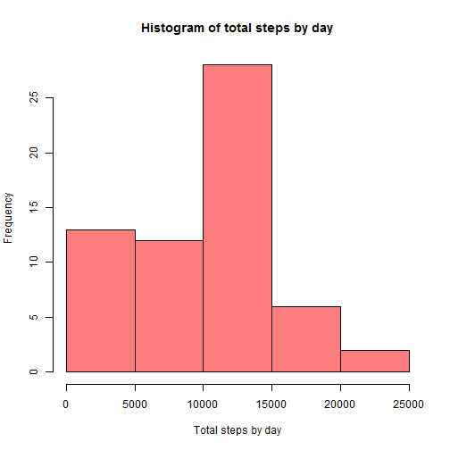
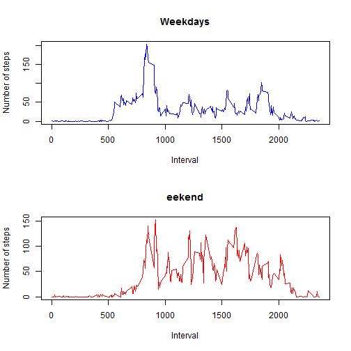

**Read in the dataset:**


```r
activity_data <- read.table("activity.csv", header = TRUE, sep = "," )
```

**What is the average number of steps taken per day?**  

(ignore missing values)  
- Aggregate sum of steps data by day  
- Make a histogram of the total number of steps each day  
- Calculate the mean and median of the total number of steps taken per day  


```r
# calculate total number of steps each day
steps_by_day <- aggregate(activity_data$steps, by = list(activity_data$date), FUN = sum)

hist(steps_by_day$x, xlab = "Total steps taken per day", main = "Histogram of total steps taken per day",
     col = rgb(0,1,1,alpha = 0.5))
```



```r
mean_of_tot_steps_by_day <- mean(steps_by_day$x, na.rm = TRUE)
median_of_tot_steps_by_day <- median(steps_by_day$x, na.rm = TRUE)
cat(mean_of_tot_steps_by_day)
```

```
## 10766.19
```

```r
cat(median_of_tot_steps_by_day)
```

```
## 10765
```

  
**What is the average daily activity pattern? **

- Make a time series plot (i.e. type = "l") of the 5-minute interval (x-axis) and the average number of steps taken, averaged across all days (y-axis)


```r
# Replace NA values with 0
activity_data$steps[is.na(activity_data$steps)] <- 0
# aggregate steps by (5 min) interval
steps_by_interval <- aggregate(activity_data$steps, by = list(activity_data$interval), FUN = mean)
plot(steps_by_interval$x ~ steps_by_interval$Group.1, type = "l", col = "blue", xlab = "Interval",
     ylab = "Average number of steps", main = "Average number of steps by interval")
```



- Which 5-minute interval, on average across all the days in the dataset, contains the maximum number of steps?


```r
steps_by_interval$Group.1[steps_by_interval$x == max(steps_by_interval$x)]
```

```
## [1] 835
```


**Imputing missing values **  

- Calculate the total number of missing values in the dataset

```r
#re-load original dataset
activity_data <- read.table("activity.csv", header = TRUE, sep = "," )
length(activity_data$steps[is.na(activity_data$steps)])
```

```
## [1] 2304
```

- Fill in missing values with the mean of that day
- Create new data set with filled in missing data


```r
# Replace NA values with 0, calculate mean of the day
activity_data$steps[is.na(activity_data$steps)] <- 0
steps_by_day <- aggregate(activity_data$steps, by = list(activity_data$date), FUN = sum)

# Reload original dataset
activity_data <- read.table("activity.csv", header = TRUE, sep = "," )
# create new dataset
new_activity_data <- activity_data

# loop through all entries in the data
for (i in 1:nrow(activity_data)){
  # check if the steps value is NA
  if (is.na(activity_data$steps[i])){
    # replace with value from steps by day
    new_activity_data$steps[i] <- steps_by_day$x[steps_by_day$Group.1 == activity_data$date[i]]
  }
}
```

- Make a histogram of the total number of steps taken each day and Calculate and report the mean and median total number of steps taken per day. Do these values differ from the estimates from the first part of the assignment? What is the impact of imputing missing data on the estimates of the total daily number of steps?


```r
# calculate total steps taken each day with imputed data
steps_by_day <- aggregate(new_activity_data$steps, by = list(new_activity_data$date), FUN = sum)
hist(steps_by_day$x, col = rgb(1,0,0,alpha = 0.5), xlab = "Total steps by day", main = "Histogram of total steps by day")
```



```r
cat(c("old mean:", mean_of_tot_steps_by_day ))
```

```
## old mean: 10766.1886792453
```

```r
cat(c("new mean:", mean(steps_by_day$x)))
```

```
## new mean: 9354.22950819672
```

```r
cat(c("old median:", median_of_tot_steps_by_day))
```

```
## old median: 10765
```

```r
cat(c("new median:", median(steps_by_day$x)))
```

```
## new median: 10395
```

  
**Are there differences in activity patterns betweeen weekdays and weekends?  **  

Use the dataset with the filled-in missing values for this part.
- Create a new factor variable in the dataset with two levels - "weekday" and "weekend" indicating whether a given date is a weekday or weekend day.


```r
# Convert to date
new_activity_data$date <- as.Date(new_activity_data$date, format = "%Y-%m-%d")
Sys.setlocale("LC_TIME", "English")
```

```
## [1] "English_United States.1252"
```

```r
# Get days
days <- weekdays(new_activity_data$date)
# replace Sunday/Saturday with weekend, replace other days with "weekday"
days <- gsub("(Sunday|Saturday)","Weekend",days)
days <- gsub("(Monday|Tuesday|Wednesday|Thursday|Friday)", "Weekday", days)
# Add to dataset
new_activity_data$weekday <- as.factor(days)
```


- Make a panel plot containing a time series plot (i.e. type = "l") of the 5-minute interval (x-axis) and the average number of steps taken, averaged across all weekday days or weekend days (y-axis). See the README file in the GitHub repository to see an example of what this plot should look like using simulated data.


```r
# calculate average number of steps taken across all weekdays
week_data <- new_activity_data[new_activity_data$weekday == "Weekday",]
week_steps <- aggregate(week_data$steps, by = list(week_data$interval), FUN = mean)
# calculate average number of steps taken across weekend days
weekend_data <- new_activity_data[new_activity_data$weekday == "Weekend",]
weekend_steps <- aggregate(weekend_data$steps, by = list(weekend_data$interval), FUN = mean)

# Create plots
par(mfrow = c(2,1))
plot(week_steps$x ~ week_steps$Group.1, type = "l", main = "Weekdays", xlab = "Interval", ylab = "Number of steps", col = "blue")
plot(weekend_steps$x ~ weekend_steps$Group.1, type = "l", main = "Weekend", xlab = "Interval", ylab = "Number of steps", col = "red")
```



